# SmartSoma: AI-Powered Personalized Learning for Rwanda 🇷🇼

**An Offline-First Edge Computing Framework for Personalized Learning**


## 🎓 Project Overview

SmartSoma is an AI-driven educational recommender system that delivers personalized, curriculum-aligned study materials to secondary students in Rwanda. The system uses **Deep Knowledge Tracing (DKT)** with BiLSTM neural networks to predict student mastery levels and recommend optimal learning resources, even in offline environments.

## DEMO
[DEMO VIDEO](https://www.loom.com/share/93beddd558a542af823868b3e9d063d2)

### Problem Statement

Rwandan secondary students face:
- **High Student-Teacher Ratios**: 36:1, making personalized attention impossible
- **Repetition Crisis**: 21.4% repetition rate in lower secondary
- **Digital Divide**: 38-43% of schools lack internet connectivity
- **Information Overload**: REB e-portal has thousands of unranked materials

### Solution

SmartSoma provides a **24/7 AI tutor** that:
- ✅ Runs locally on school servers (Edge Computing)
- ✅ Works 100% offline after initial setup
- ✅ Predicts student performance using BiLSTM models
- ✅ Recommends CBC-aligned materials based on individual gaps
- ✅ Provides real-time teacher dashboards for data-driven intervention

---

## 📂 Project Structure

```
SmartSoma/
├── notebooks/
│   └── model_development.ipynb    # ⭐ Core ML notebook (BiLSTM + metrics)
├── backend/
│   └── main.py                    # FastAPI server with ML inference
├── data/
│   ├── students.csv               # 50 synthetic students
│   ├── materials.csv              # 100 CBC-aligned materials
│   └── interactions.csv           # 1,200+ student interactions
├── scripts/
│   └── synthetic_data_generator.py # Data generation script
├── models/
│   ├── bilstm_dkt_model.pth      # Trained BiLSTM weights
│   ├── performance_summary.txt    # Model metrics
│   └── viz_*.png                  # Performance visualizations
├── frontend/                      # React PWA (student/teacher dashboards)
├── requirements.txt               # Python dependencies
└── README.md                      # This file
```

---

## 🔬 ML Model Architecture

### BiLSTM Deep Knowledge Tracing

The core AI engine uses a **Bidirectional LSTM** to model student learning as a sequence:

```
Input: [material_id, score, duration, mastery]  (sequence of 15 interactions)
    ↓
Embedding Layer
    ↓
BiLSTM (128 hidden units, 2 layers, dropout=0.3)
    ↓
Fully Connected (64 neurons)
    ↓
Sigmoid Output → Predicted Mastery Level (0-1)
```

**Training Details:**
- **Dataset**: 1,200 interactions, 50 students, 100 materials
- **Train/Test Split**: 80/20
- **Optimizer**: Adam (lr=0.001)
- **Loss Function**: MSE
- **Epochs**: 30

---

## 📊 Performance Metrics

| Metric | Value | Target | Status |
|--------|-------|--------|--------|
| **RMSE** | 0.0881 | < 0.25 | ✅ **Excellent** |
| **MAE** | 0.0667 | < 0.20 | ✅ **Excellent** |
| **R² Score** | 0.1436 | > 0.70 | ⚠️ **Low** |
| **Accuracy** | 97.39% | > 80% | ✅ **High** |
| **AUC-ROC** | 0.7820 | > 0.75 | ✅ **Good** |
| **Precision@5** | 0.00 | > 0.70 | ❌ **Needs Work** |
| **Precision@10** | 0.10 | > 0.70 | ❌ **Needs Work** |

> **Note:** The low R² score (0.14) and Precision@K reflect a known limitation of training on a small synthetic dataset (50 students, 100 materials, 1,200 interactions). The model achieves strong mastery-level binary classification (97.39% accuracy, AUC-ROC 0.78) but struggles with regression variance on sparse interaction data. Recommendation quality would improve significantly with real student interaction data at scale.

### Hardware Benchmark

Inference latency measured over 100 runs on a MacBook Pro (Intel Core i7, 8-core, macOS 12.6, Python 3.9):

| Interaction Sequence Length | Mean | Median | P95 |
|-----------------------------|------|--------|-----|
| 1 interaction  | 1.57 ms | 1.34 ms | 2.18 ms |
| 5 interactions | 1.39 ms | 1.31 ms | 1.98 ms |
| 10 interactions | 1.44 ms | 1.32 ms | 2.14 ms |
| 15 interactions (max) | 1.45 ms | 1.36 ms | 2.00 ms |

Key observations:
- **Sub-2ms median inference** across all sequence lengths — suitable for real-time recommendations
- Latency is consistent regardless of sequence length, confirming the BiLSTM handles variable-length input efficiently
- Benchmark script available at `backend/scripts/benchmark.py` — can be run on target hardware (Raspberry Pi, school server) to verify edge deployment performance

To reproduce:
```bash
python -m backend.scripts.benchmark --offline --runs 100
```

### Visualizations

All performance visualizations are saved in `models/`:
- `viz_mastery_distribution.png` - Student mastery distribution
- `viz_competency_mastery.png` - Performance by CBC competency
- `viz_training_history.png` - Loss curves
- `viz_predictions.png` - Actual vs predicted scatter plot
- `viz_confusion_matrix.png` - Binary classification matrix
- `viz_roc_curve.png` - ROC curve with AUC
- `viz_precision_at_k.png` - Recommendation quality

---

## 🛠️ Setup Instructions

### Prerequisites

- Python 3.9+
- Node.js 16+ (for frontend)
- 2GB RAM minimum
- macOS/Linux/Windows

### 1. Clone Repository

```bash
git clone https://github.com/Reennee/SmartSoma.git
cd SmartSoma
```

### 2. Backend Setup

```bash
# Create virtual environment
python3 -m venv venv
source venv/bin/activate  # On Windows: venv\\Scripts\\activate

# Install dependencies
pip install -r requirements.txt

# Generate synthetic data (if not already present)
python scripts/synthetic_data_generator.py

# Start FastAPI server
uvicorn backend.main:app --reload

# Server will be available at: http://localhost:8000
# Swagger UI docs: http://localhost:8000/docs
```

### 3. Run Jupyter Notebook

```bash
# Activate environment
source venv/bin/activate

# Launch Jupyter
jupyter notebook notebooks/model_development.ipynb

# Run all cells to:
# - Visualize data
# - Train BiLSTM model
# - Generate performance metrics
# - Export trained model
```

## 🚀 API Documentation

### Base URL
```
http://localhost:8000
```

### Endpoints

| Method | Endpoint | Description |
|--------|----------|-------------|
| `GET` | `/` | Health check |
| `GET` | `/api/stats` | System statistics |
| `POST` | `/api/recommend` | Get personalized recommendations |
| `POST` | `/api/track-interaction` | Log student interaction |
| `GET` | `/api/student/{id}/progress` | Student progress dashboard |
| `GET` | `/api/materials` | List all materials |

### Example: Get Recommendations

**Request:**
```bash
curl -X POST http://localhost:8000/api/recommend \\
  -H "Content-Type: application/json" \\
  -d '{
    "student_id": 1,
    "limit": 5,
    "subject": "Mathematics"
  }'
```

**Response:**
```json
[
  {
    "material_id": 42,
    "title": "Mathematics - Algebra and Equations - Lesson 5",
    "subject": "Mathematics",
    "competency": "Algebra and Equations",
    "grade_level": "S2",
    "difficulty": "Intermediate",
    "predicted_mastery": 0.653,
    "relevance_score": 0.872
  }
]
```
## 🎨 System Architecture

```mermaid
graph TB
    A[Student Browser<br/>React PWA] -->|API Calls| B[FastAPI Backend<br/>Edge Server]
    B --> C[BiLSTM Model<br/>PyTorch]
    B --> D[SQLite Database<br/>Local Storage]
    C --> E[Recommendation Engine<br/>Hybrid Filtering]
    E --> A
    B -.Optional Sync.-> F[Cloud Server<br/>PostgreSQL]
    
    style A fill:#61DAFB
    style B fill:#009688
    style C fill:#EE4C2C
    style D fill:#003B57
    style E fill:#9C27B0
    style F fill:#FF9800
```



### Key Components

1. **Frontend (React PWA)**:  
   - Student dashboard with personalized recommendations
   - Teacher analytics with class-wide insights
   - Offline-first with Service Workers

2. **Backend (FastAPI)**:  
   - RESTful API for all operations
   - Runs on local school server (Raspberry Pi)
   - Auto-generated Swagger documentation

3. **ML Engine (BiLSTM)**:  
   - Deep Knowledge Tracing for mastery prediction
   - Hybrid recommendation (content-based + collaborative)
   - Optimized for low-resource devices

4. **Data Layer**:  
   - SQLite for local storage
   - Optional PostgreSQL for cloud sync
   - CSV exports for portability

---

## 📐 Database Schema (ERD)

```
┌─────────────┐         ┌──────────────┐         ┌────────────────┐
│  students   │         │ interactions │         │   materials    │
├─────────────┤         ├──────────────┤         ├────────────────┤
│ student_id  │◄───────┤ student_id   │         │ material_id    │
│ name        │         │ material_id  ├────────►│ title          │
│ grade_level │         │ timestamp    │         │ subject        │
│ baseline... │         │ score        │         │ competency     │
└─────────────┘         │ mastery_level│         │ difficulty     │
                        │ duration...  │         │ grade_level    │
                        └──────────────┘         └────────────────┘
```

---

## 🚢 Deployment Plan

### Local Deployment (School Server)

**Hardware Requirements:**
- Raspberry Pi 4 (4GB RAM) or equivalent
- 32GB microSD card
- Local WiFi router

**Steps:**
1. Flash Raspberry Pi OS
2. Clone repository
3. Install Python dependencies
4. Run FastAPI server on boot
5. Configure local network access

**Docker Deployment:**
```bash
# Build image
docker build -t smartsoma:latest .

# Run container
docker run -d -p 8000:8000 \\
  -v ./data:/app/data \\
  -v ./models:/app/models \\
  smartsoma:latest
```

### Cloud Deployment (Optional Central Sync)

- **Platform**: Railway / Render / Vercel
- **Purpose**: Aggregate anonymized data for national insights
- **Sync Frequency**: Weekly (when internet available)

---

## 👨‍💻 Author

**René Ntabana**  
BSc. Software Engineering  
African Leadership University

**Supervisor**: Simeon Nsabiyumva  
**Date**: February 2026

---

## 📚 References

1. Nsabimana et al. (2024). *Smart classrooms and education outcomes in Rwanda*. UNU-WIDER.
2. Airlangga, G. (2024). *Predicting Student Performance Using BiLSTM*. MALCOM Journal.
3. Minecofin (2020). *Rwanda Vision 2050*. Government of Rwanda.
4. REB (2025). *Competence-Based Curriculum Resources*. Rwanda Education Board.

---

## 🙏 Acknowledgments

- Rwanda Education Board (REB) for curriculum resources
- UNU-WIDER for research insights on smart classrooms in Rwanda
- The open-source ML community (PyTorch, FastAPI, scikit-learn)

---

**SmartSoma** - *Democratizing personalized education for Rwanda's last-mile learners* 🚀